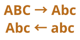

<div align="center">
  
  <h1>Title Case</h1>
  <p><a href="/docs/README-EN.md">English</a></p>
  <p><a href="https://github.com/BarudakRosul/title-case/issues/new?assignees=&labels=bug&projects=&template=bug_report.yml">Laporkan Bug</a> · <a href="https://github.com/BarudakRosul/title-case/issues/new?assignees=&labels=enhancement&projects=&template=feature_request.yml">Ajukan Fitur</a></p>
  <p>
    <a href="https://github.com/BarudakRosul/title-case/actions/workflows/test.yml"></a>
    <a href="https://npmjs.com/package/@barudakrosul/title-case"></a>
    <a href="https://npmjs.com/package/@barudakrosul/title-case"></a>
    <a href="/LICENSE"></a>
    <a href="https://npmjs.com/package/@barudakrosul/title-case"></a>
    <a href="https://github.com/BarudakRosul/title-case/stargazers"></a>
    <a href="https://github.com/BarudakRosul/title-case/network/members"></a>
    <a href="https://github.com/BarudakRosul/title-case/issues"></a>
  </p>
  <a href="https://techforpalestine.org/learn-more"></a>
</div>

## Daftar Isi

1. [Pendahuluan](#pendahuluan)
2. [Fitur](#fitur)
3. [Instalasi](#instalasi)
4. [Penggunaan](#penggunaan)
5. [Berkontribusi](#berkontribusi)
6. [Lisensi](#lisensi)
7. [Penghargaan](#penghargaan)
8. [Donasi](#donasi)
9. [Catatan Perubahan](#catatan-perubahan)

## Pendahuluan

Title Case adalah sebuah ekstensi JavaScript yang mengkonversi teks string menjadi format judul, di mana huruf pertama dari setiap kata dikapitalisasi. Ini dibuat semirip mungkin dengan fungsi `title()` di Python.

## Fitur

Title Case menawarkan fitur-fitur berikut:

- Mengkonversi teks string menjadi format judul.
- Opsi untuk mempertimbangkan tanda hubung sebagai batas kata.
- Dapat di integrasikan ke dalam kode TypeScript.

## Instalasi

Untuk menginstal Title Case secara lokal, ikuti langkah instalasi ini:

```shell
npm install @barudakrosul/title-case
```

## Penggunaan

Untuk memulai menggunakan Title Case, import modulnya terlebuh dahulu:

**1\. CommonJS**
```javascript
require("@barudakrosul/title-case");
```

**2\. ESM (ECMAScript Modules)**
```javascript
import "@barudakrosul/title-case";
```

**3\. TypeScript**
```typescript
import "@barudakrosul/title-case";
```

Contoh penggunaan:

```javascript
let text = "hello world! this is an example-string.";
console.log(text.toTitle());

// Result:
// "Hello World! This Is An Example-String."
```

Contoh jika opsi `breakonhyphens` di setel ke `false`:

```javascript
let text = "hello world! this is an example-string.";
console.log(text.toTitle(false));

// Result:
// "Hello World! This Is An Example-string."
```

## Berkontribusi

Kontribusi pada Title Case sangat dihargai! Baik melaporkan bug, menyarankan fitur baru, atau berkontribusi pada perbaikan kode.

## Lisensi

Title Case dilisensikan di bawah Lisensi CC0-1.0 - lihat berkas [LICENSE](/LICENSE) untuk detailnya.

## Penghargaan

Title Case menghargai dukungan dan kontribusi dari individu dan proyek sumber terbuka berikut:

- [@Achixz](https://github.com/Achixz) - Pengembang utama dan pencipta aplikasi.
- Komunitas sumber terbuka - Untuk kontribusi berharga pada alat dan perpustakaan yang digunakan dalam proyek ini.

## Donasi

Kami sangat menghargai dukungan Anda untuk terus mengembangkan proyek ini. Jika Anda merasa proyek ini bermanfaat, Anda dapat mendukung kami dengan donasi:

[](https://ko-fi.com/barudakrosul)
[](https://trakteer.id/barudakrosul)

Setiap donasi, berapapun jumlahnya, sangat berarti bagi kami. Terima kasih atas dukungan Anda! ❤️

## Catatan Perubahan

Terus ikuti perubahan dan pembaruan terbaru Title Case dengan mengacu ke [Catatan Perubahan](https://github.com/BarudakRosul/title-case/releases).

Terima kasih telah memilih Title Case! Kami bertujuan untuk memberikan solusi yang mudah untuk mengubah teks string ke dalam format judul.

[](https://techforpalestine.org/learn-more)